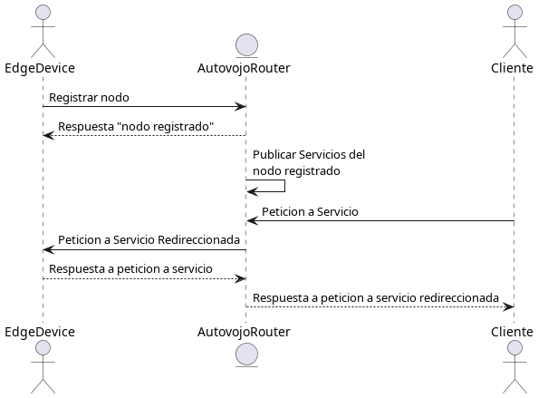
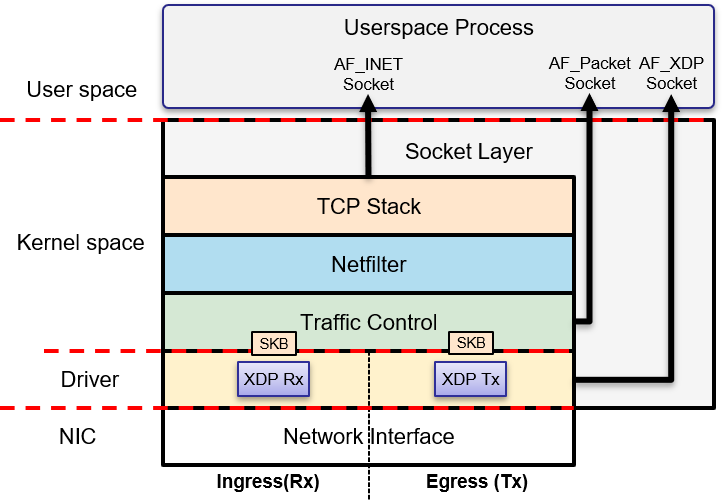
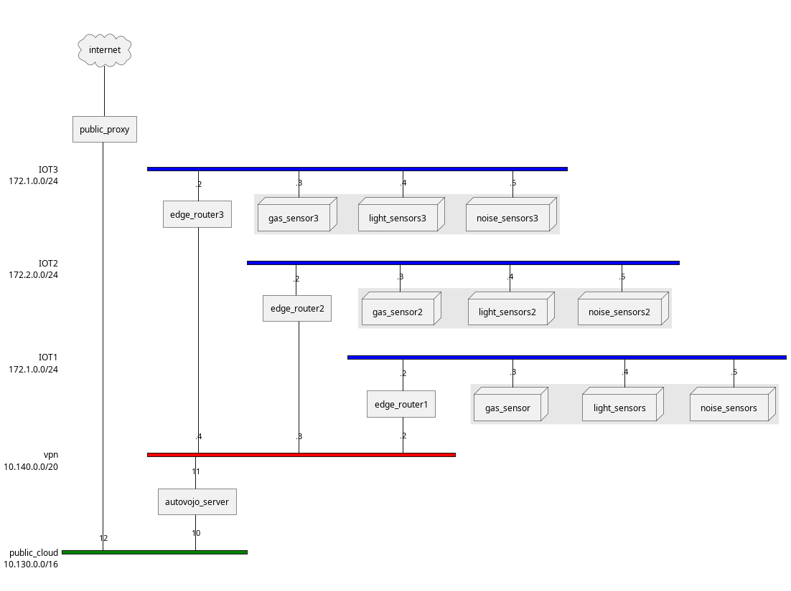
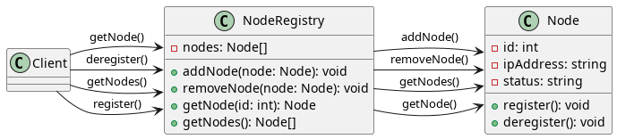
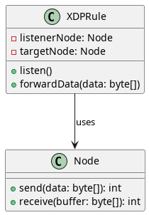

# Tecnologias

## eBPF

eBPF  (Filtro de Paquetes de Berkeley extendido) es una tecnología que permite a los usuarios ejecutar programas personalizados en el núcleo de Linux para filtrar y monitorizar paquetes de red, así como para recopilar otros datos del núcleo. eBPF se introdujo en Linux 3.15 y desde entonces se ha convertido en una poderosa herramienta para administradores de redes y sistemas, así como para investigadores de seguridad.

Una de las características clave de eBPF es su capacidad para acceder y leer datos del núcleo, como paquetes de red o argumentos de llamadas de sistema. Esto permite que los programas eBPF recopilen datos y proporcionen información sobre lo que está sucediendo en el sistema. Por ejemplo, un programa eBPF podría usarse para monitorizar el tráfico de red y recopilar estadísticas sobre el número y tipos de paquetes que se envían y reciben.

Los programas eBPF se escriben en un lenguaje especial llamado ensamblador eBPF, que está diseñado para ser sencillo y seguro de ejecutar en el núcleo. Luego, estos programas se compilan y cargan en el núcleo mediante herramientas especiales, como el comando bpf o la utilidad ip. Una vez cargado, el programa eBPF se puede adjuntar a un gancho específico en el núcleo, como una interfaz de red o una llamada de sistema, y se ejecutará cada vez que se desencadene el gancho.[@10.1145/3371038]

Otra característica importante de eBPF es su seguridad. Los programas eBPF se ejecutan en un entorno aislado dentro del núcleo, lo que impide que accedan a datos sensibles o modifiquen estructuras críticas del núcleo. Esto hace que eBPF sea una tecnología atractiva para ejecutar programas de terceros o no de confianza en el núcleo sin comprometer la seguridad.

Además de la monitorización de la red y la recopilación de datos, eBPF tiene muchos otros usos. Se puede usar para el análisis de rendimiento, la monitorización de seguridad y incluso como elemento básico para crear nuevas funcionalidades del núcleo. Por ejemplo, el firewall basado en BPF (bpf_firewall) utiliza eBPF para proporcionar una solución de firewall más flexible y eficiente para Linux.  [@EBPFIntroductionTutorials]

## Rust

Rust  es un lenguaje de programación desarrollado por Mozilla en 2010. Es un lenguaje compilado y con tipado estático diseñado para ser rápido, eficiente y seguro. Rust es conocido por su capacidad para prevenir errores de memoria, lo que lo convierte en una buena opción para la programación de sistemas.

Una de las características clave de Rust es su seguridad de memoria. Los errores de memoria, como las referencias nulas o colgantes, son una fuente común de errores en el software. Estos errores pueden causar cuelgues, corrupción de datos y vulnerabilidades de seguridad. Rust aborda este problema a través de una combinación de verificaciones en tiempo de compilación y en tiempo de ejecución, que ayudan a garantizar que la memoria se use de manera segura y correcta. Esto hace que Rust sea una buena opción para escribir código de bajo nivel, como sistemas operativos, controladores de dispositivos y otros programas de sistema.

Además de su énfasis en la seguridad de la memoria, Rust también está diseñado para ser un lenguaje rápido y eficiente. Utiliza una variedad de técnicas, como el tipado estático y las abstracciones de costo cero, para garantizar que el código se ejecute rápidamente y use una cantidad mínima de memoria. Esto hace que Rust sea una buena opción para aplicaciones críticas en términos de rendimiento, como servidores web, motores de juegos y pipelines de procesamiento de datos.

Rust también tiene soporte integrado para la concurrencia, lo que le permite aprovechar los procesadores de múltiples núcleos modernos. Utiliza un modelo de concurrencia de estado compartido, que es más fácil de usar que otros modelos, como el modelo de actores o el modelo CSP. Esto hace que sea más fácil escribir código concurrente correcto en Rust que en muchos otros lenguajes.

Además de sus características de seguridad, rendimiento y concurrencia, Rust también es un lenguaje altamente flexible. Tiene soporte para paradigmas de programación procedural, funcional y orientado a objetos, así como un poderoso sistema de macro que permite la generación de código y la metaprogramación. Esto lo convierte en una buena opción para una amplia gama de aplicaciones, desde la programación de sistemas de bajo nivel hasta el desarrollo web de alto nivel.

En general, Rust es un lenguaje de programación potente y versátil que es ideal para la programación de sistemas. Ofrece una combinación única de seguridad, rendimiento y concurrencia, lo que lo convierte en una buena opción para una amplia gama de aplicaciones. Si busca un lenguaje que le ayude a escribir código seguro, eficiente y concurrente, Rust puede ser una opción a considerar.  [@RustProgrammingLanguage]

## gRPC

`gRPC` es un marco moderno, de código abierto y altas prestaciones de llamada de procedimiento remoto (RPC) que se puede ejecutar en cualquier lugar. Permite que las aplicaciones cliente y servidor se comuniquen de manera transparente y facilita la creación de sistemas conectados.

`gRPC` se basa en la idea de definir un servicio, especificando los métodos que se pueden llamar de forma remota con sus parámetros y tipos de retorno. En el lado del servidor, el servidor implementa esta interfaz y ejecuta un servidor `gRPC` para manejar las llamadas de cliente. En el lado del cliente, el cliente tiene un stub (proxy del lado del cliente) que proporciona los mismos métodos que el servidor.

Una de las principales ventajas de `gRPC` es su rendimiento. Utiliza HTTP/2 para el transporte, lo que permite una comunicación eficiente en la red, y Protocol Buffers como lenguaje de descripción de interfaz y formato de serialización de datos, lo que proporciona una forma rápida y eficiente de serializar datos estructurados. `gRPC` también admite streaming, lo que permite la comunicación bidireccional y el control de flujo.

Además de su rendimiento, `gRPC` tiene muchas otras ventajas. Es independiente de la plataforma, lo que significa que los clientes y servidores se pueden escribir en diferentes lenguajes y aún así comunicarse de manera transparente. También tiene un fuerte enfoque en la compatibilidad hacia atrás, lo que facilita la evolución de las APIs con el tiempo sin romper los clientes existentes.

`gRPC` es utilizado por muchas empresas y proyectos, incluyendo Google, Square y Kubernetes. Cuenta con un fuerte soporte en la comunidad de código abierto, con clientes y servidores disponibles en muchos lenguajes, incluyendo C++, Java, Go, Python, Ruby y más.

En general, `gRPC` es una tecnología poderosa y eficiente para construir sistemas conectados. Su rendimiento, independencia de la plataforma y enfoque en la compatibilidad hacia atrás lo convierten en una opción atractiva para muchos tipos diferentes de aplicaciones. [@DocumentationGRPC]

# Autovojo

`Autovojo` es un sistema que busca aprovechar las capacidades del núcleo de Linux para procesar paquetes antes que sean llevados a el espacio de usuario usando la maquina virtual `eBPF`. Para ello se uso el lenguaje de programación `Rust` tanto para crear el código que se ejecutara en la maquina virtual, como el codigo que se ejecuta en el espacio de usuario para configurar y validar las entradas de usuario. La arquitectura es de cliente servidor donde el servidor es un servicio `gRPC` que registra los servicios de los nodos que se registran para luego crear usar un puerto en el servidor para direccionar a este nodo. 

::: note
El codigo de autovojo puede encontrarlo en el repositorio [\faGithub freexploit/autovojo](https://github.com/freexploit/autovojo)
:::

Básicamente esto hace que la maquina  funcione como un router sencillo, que es configurado por los dispositivos que se registran como nodos en el sistema. Esto permite que un ambiente sea auto configurable al reportar que servicios hay disponibles y luego publicarlos a una red publica o clientes que se encuentran fuera del firewall. 

La ejecución del procesamiento de los paquetes se ejecuta en las capas inferiores de la pila de red del núcleo de Linux, permitiendo una alta eficiencia, y reduciendo significativamente los tiempos de respuesta.[@OpenP4Based2020]

## Seguridad

Elementos que no fueron incluidos en el desarrollo de esta prueba de concepto, pero que son esenciales para ejecutarse en producción son la autenticación de los dispositivos así como limitar el acceso y alcance de los servicios que serian publicados de esta manera. Es posible que algún agente adversario pueda ingresar un dispositivo que entienda el protocolo del API y de esa manera crear una puerta trasera al registrase y configurar su dispositivo para acceder a la red local.

Otro caso es que algún dispositivo ya registrado y publicando servicios tenga una vulnerabilidad que permita a un actor malicioso acceder a este y agregar nuevos servicios, por esa razón el servidor `gRPC` debe tener la capacidad de limitar tanto el acceso así como los servicios que podrían publicarse.

# Diagramas

## Arquitectura de Red 

## Diagrama de clases

## Conclusiones

Entre los principales retos encontrados a la hora de poner en práctica esta solución es la poca documentación existente, específicamente para la librería aya-rs. Afortunadamente, es un problema que los desarrolladores creadores del código fuente estás activamente trabajando para solucionar. 
Por otro lado, queremos recalcar la utilidad del marco `gRPC`. Que nos permite realizar Interfaces de Programación para Aplicaciones (APIs) de forma rápida, con una implementación sencilla y sin demasiados problemas. 
Por último, eBPF abre la posibilidad de tener mejoras en el rendimiento de la red de los sistemas, y así evitar cuellos de botella al ejecutarse en el kernel. Sin embargo, su implementación es un poco más compleja que otras en el sistema operativos Linux, como netfilter por ejemplo. 

## Bibliografía
